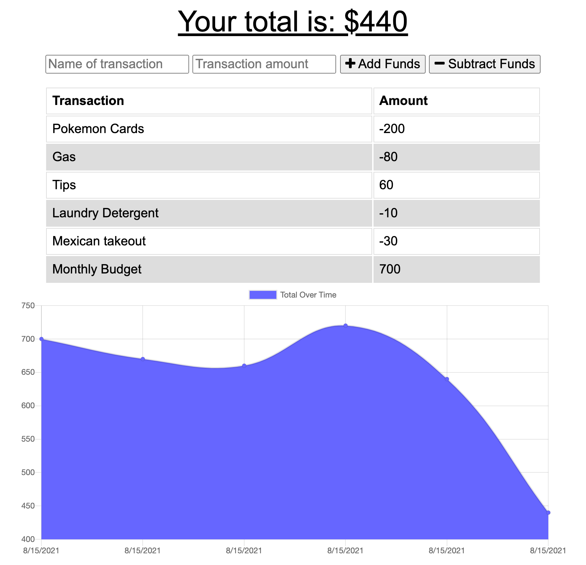

# Budget-Tracker

## Heroku Deployment Link
  
  [Budget Tracker App](https://immense-springs-27873.herokuapp.com/)

## Description: 
- For this task, I wanted to allow users to view a chart that allows them to add and subtract funds. This app would allow users to be able to track their own personal budget. 
- The reason I built this fitness tracker was to learn more about MongoDB and creating a PWA with service workers and a manifest.  
- This task helped me gain a better understanding of creating PWA and how to deploy on Heroku with MongoDB Atlas.

## Tracker:

